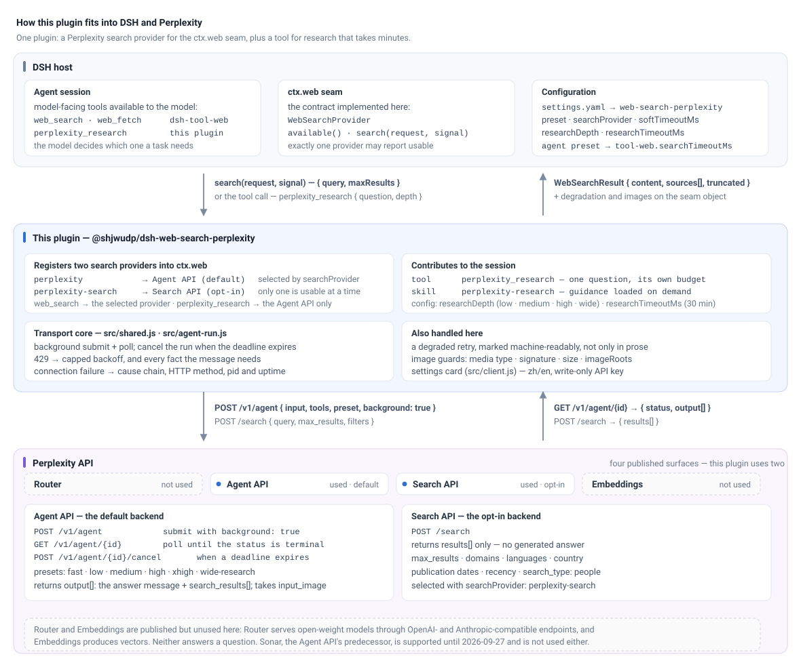

# @shjwudp/dsh-web-search-perplexity

A Perplexity-backed search provider for the DeepSeek Harness `ctx.web` seam. It gives
a DSH agent quick web lookups, and a second tool for research that takes minutes.

## What it does



*DSH supplies the agent session, the `ctx.web` seam and the configuration; this
plugin registers two Perplexity providers into that seam and adds the research tool;
the Agent and Search APIs are the two of Perplexity's four published surfaces that
the plugin uses. Open the image for the full-size version.*

- **Answers, not just links.** By default searches go to Perplexity's Agent API, which
  returns a synthesized answer with its sources, mapped into the seam's normalized
  result — so the harness's own `web_search` keeps working exactly as before.
- **A tool for questions that need minutes.** `perplexity_research` carries its own
  30-minute budget, so a question that would blow `web_search`'s 60 s ceiling comes back
  as an answer instead of a timeout.
- **Images work.** A query naming a local image file or a public image URL is sent to
  Perplexity as an image, so "what is wrong with this board" is a supported question.
- **Failures say what happened.** A rate limit, a connection failure, and a backend that
  researched but returned no answer are three distinct classes, each naming what a
  reader needs to decide what to do next.
- **A slow answer is labelled.** When a query is retried on a faster preset, the result
  says so in a machine-readable field, not only in prose.

**Why this package exists:** the official `@deepseek-ai/dsh-web-search-perplexity`
imports `@deepseek-ai/dsh-environment`, which is not published on the npm registry
(E404) for current dsh releases. This plugin has no internal-only dependencies.

## Install

```bash
dsh plugin --profile web add github:shjwudp/dsh-web-search-perplexity#v0.1.7-rc.1
```

Tell the web seam to use the Perplexity provider in
`~/.dsh/profiles/<profile>/cordis.patch.yml`:

```yaml
- id: web
  config:
    searchProvider: perplexity
    fetchProvider: http
```

The `web` profile ships with the model-facing tools disabled, so enable them in the
same patch with `- id: tool-web, disabled: false`.

Set the API key where DSH will read it — in the terminal that starts DSH, or later in
the web UI at Settings → Plugins → Plugin configuration → Perplexity web search:

```powershell
# Windows PowerShell
$env:PERPLEXITY_API_KEY = "pplx-..."
```

```bash
# macOS / Linux (bash/zsh)
export PERPLEXITY_API_KEY="pplx-..."
```

Never put the key in a patch file. Restart DSH, and the agent has both tools.

## Compatibility

- Needs a DSH profile with the `ctx.web` seam mounted. The plugin injects `web`,
  `tools`, and `systemPrompt` — all three are required, since it also contributes a
  tool and a prompt section. A composition missing one fails at load with a message
  naming it, rather than registering nothing.
- Needs a Perplexity API key: the `PERPLEXITY_API_KEY` environment variable, or one
  saved in the settings card.
- Node ≥ 18. Peer dependencies `@deepseek-ai/dsh-tools`, `@deepseek-ai/dsh-web`, and
  `@deepseek-ai/schemastery` are all optional and declared as `^0.1.2-rc.1` /
  `^3.18.1-rc.1`; older `0.1.2-rc.x` hosts are within range.
- Tested with **DSH 0.1.5-rc.1** (`@deepseek-ai/dsh-web` 0.1.5-rc.2,
  `@deepseek-ai/schemastery` 3.18.2). The host version numbers are DSH's, not this
  plugin's; this package's own versions are the `v*` tags.
- Perplexity has replaced its Sonar Chat Completions API with the Agent API (Sonar
  stays supported until 2026-09-27), so there is no `apiMode` switch and no Sonar
  fallback.

## The settings worth knowing

| Key | Default | Meaning |
|---|---|---|
| `apiKey` | unset | Perplexity API key; normally saved in the UI instead |
| `preset` | unset | Agent preset: `fast`, `low`, `medium`, `high`, `xhigh`, `wide-research` |
| `searchProvider` | `''` | Blank or `perplexity` = Agent API; `perplexity-search` = Search API |
| `researchDepth` | `low` | Default depth for `perplexity_research` |
| `softTimeoutMs` | derived from `preset` | Deadline before one degraded retry; `0` disables it |
| `imageInput` | enabled | Set to `off` to send image paths as ordinary text |

Everything else — the full 23-key table, the API key resolution order, the settings
card layout, and how to switch backends — is in
[configuration](docs/configuration.md).

## Documentation

| | |
|---|---|
| [configuration](docs/configuration.md) | Every setting, the settings card, and choosing between the two Perplexity backends |
| [tools](docs/tools.md) | `web_search` vs `perplexity_research`, depths, the background lifecycle, response mapping |
| [timeouts](docs/timeouts.md) | Tool budgets, measured latency, the derived soft deadline, and degradation markers |
| [images](docs/images.md) | Sending an image, the three read guards, and what it costs |
| [failures](docs/failures.md) | How rate limits, connection failures, and a no-output research run each report themselves |
| [development](docs/development.md) | Tests, `sync:profile`, localization, and the skill's two copies |
| [model-stage-no-output](docs/model-stage-no-output.md) | The incident that shaped the research path: evidence and the A/B that found the output cap |
| [upstream-report-model-no-output](docs/upstream-report-model-no-output.md) | The report sent upstream, with reproducible run ids |

## Development

```bash
npm run check        # syntax-check the host, client, and generated skill module
npm test             # ten suites, all offline, no API quota
npm run build:skill  # regenerate src/skill.js from the markdown skill source
npm run sync:profile # copy this working tree into every DSH profile that depends on it
```

See [development](docs/development.md) for what each suite covers, why `sync:profile`
is needed at all, and the two places the skill can live.

## License

MIT
